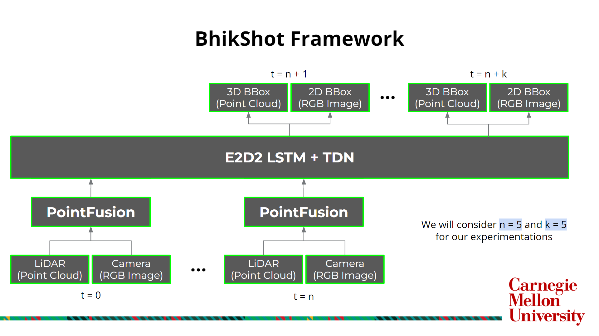

# BhikShot - Sensor Fusion and Tracking in Autonomous Racing

## Our Framework

## Resources
* [KITTI Dataset](https://www.cvlibs.net/datasets/kitti/eval_tracking.php) Official Website
* [Presentation Slides](https://docs.google.com/presentation/d/1LQ23Hgq7JoDElgD_whsuQOao0Mfata5EgWng8FSBgxI/edit#slide=id.g23ab9c3431b_0_10) walking through our project
* [Google Drive Folder](https://drive.google.com/drive/folders/1hHzur6tAqjqWdxsjNEWdFSInPTUttpr2?usp=sharing) containing all of our datasets and results

## References
* PointFusion - [Paper](https://arxiv.org/pdf/1711.10871.pdf), [Unofficial GitHub Implementation](https://github.com/mialbro/PointFusion)
* 11-785, Introduction to Deep Learning - [Course Website](https://deeplearning.cs.cmu.edu/S23/)
